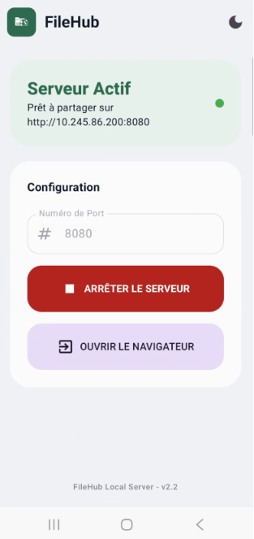
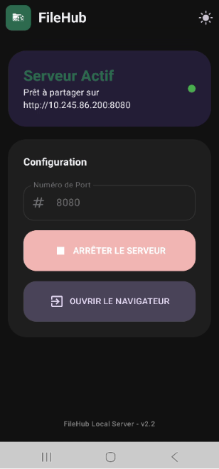
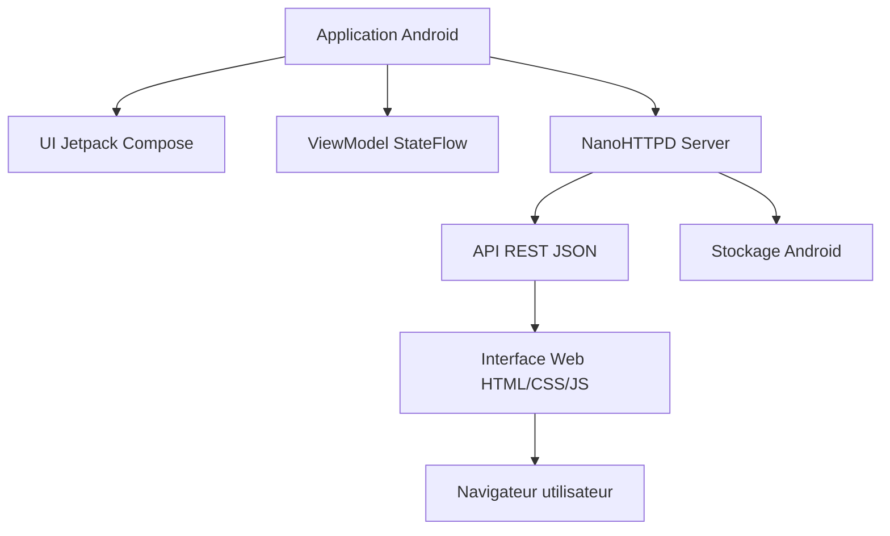

# FileHub Server

<p align="left">
  
</p>

Serveur HTTP local Android permettant d’accéder et gérer les fichiers d’un smartphone depuis un navigateur web sur le même réseau Wi-Fi.

---

## Table des matières

- [Présentation](#présentation)
- [Fonctionnalités](#fonctionnalités)
- [Charte graphique et thème](#charte-graphique-et-thème)
- [Capture d’écran](#capture-décran)
- [Architecture](#architecture)
- [Utilisation](#utilisation)
- [Installation](#installation)
- [Ressources](#ressources)

---

## Présentation

FileHub Server transforme un smartphone Android en serveur de fichiers accessible via navigateur.

Il permet la gestion complète des fichiers sans câble USB.

---

## Fonctionnalités

### Fonctionnalités principales

| Fonction | Description |
|----------|-------------|
| Naviguer | Parcourir l’arborescence du stockage |
| Télécharger | Récupérer un fichier |
| Téléverser | Envoyer un fichier vers le téléphone |
| Éditer | Modifier un fichier texte |
| Supprimer | Supprimer fichier ou dossier |
| Créer | Créer un dossier |
| Renommer | Renommer fichier ou dossier |
| Visualiser images | Afficher les photos du smartphone |

---

## Technologies utilisées

### Android

- Kotlin
- Jetpack Compose (UI)
- ViewModel + StateFlow (architecture MVVM)
- Android SDK (API 23+)

### Serveur

- NanoHTTPD (serveur HTTP léger embarqué)
- API REST (JSON)
- Gestion des fichiers système Android

### Interface Web

- HTML5
- CSS3
- JavaScript vanilla
- Fetch API

### Communication

- HTTP local via réseau Wi-Fi
- Échange JSON pour les métadonnées
- Téléchargement direct de fichiers (stream HTTP)

---

## Charte graphique et thème

L’application repose sur une interface moderne, sobre et orientée productivité, avec un système de thème clair/sombre permettant une utilisation confortable dans tous les contextes.

### Thème de l’application

| Élément | Mode clair | Mode sombre |
|--------|------------|--------------|
| Thème principal | Light (par défaut) | Dark (toggle manuel) |
| Couleur d’accent | #2D6A4F | #40916C |
| Arrière-plan | #F1F3F5 | #121212 |
| Surfaces (cards, sidebar) | #FCFCFC | #1E1E1E |
| Texte principal | #111827 | #F3F4F6 |

### Direction visuelle

- Couleurs dominantes : vert et gris pour évoquer la fiabilité et la gestion de fichiers
- Accent principal : vert utilisé pour les actions importantes (navigation, téléchargement, validation)
- Design basé sur la lisibilité et la hiérarchie visuelle

### Choix UI/UX

- Interface minimaliste type explorateur de fichiers
- Hiérarchie claire entre dossiers et fichiers
- Boutons d’action explicites (navigation, téléchargement, suppression)
- Optimisation pour usage desktop via navigateur
- Bascule fluide entre mode clair et sombre
- Fil d’Ariane (breadcrumb) pour la navigation
- Effets de survol pour indiquer les éléments interactifs

---

## Capture d’écran

### Page principale

<p align="center">
  
  
</p>
---

## Architecture



---

## Utilisation

### Mode normal (Wi-Fi)

1. Lancer l’application Android
2. Connecter le téléphone et le PC sur le même réseau Wi-Fi
3. Récupérer l’adresse IP affichée dans l’application
4. Ouvrir cette adresse dans un navigateur
5. Accéder aux fichiers du téléphone

### Accès en mode développement (ADB / USB)

Cette méthode permet d'accéder à un serveur lancé sur un appareil Android depuis un PC via USB.

#### Prérequis
- USB debugging activé sur le téléphone
- ADB installé (Android SDK Platform Tools)
- Téléphone connecté en USB
- Application en cours d’exécution sur l’appareil
- Le serveur écoute sur le port `8080` dans l’application

#### Vérifier la connexion ADB
Dans le terminal (Android Studio ou terminal système) :
```bash
adb devices
```
Vous devez voir votre appareil listé.


#### Redirection du port (port forwarding)
Toujours dans le terminal :
```bash
adb forward tcp:8080 tcp:8080
```
Cette commande redirige le port `8080` du PC vers le port `8080` du téléphone.

#### Accès au serveur
Une fois la redirection active, accéder au serveur depuis le navigateur du PC :
```
http://127.0.0.1:8080
```

#### Notes : 
- L’application doit être déjà lancée sur le téléphone
- Le serveur doit écouter sur `0.0.0.0` ou `localhost` selon la configuration
- Si le port est déjà utilisé, changer `8080` par un autre port
- La redirection ADB est perdue si l’appareil est déconnecté

---

## Installation

```bash
git clone https://github.com/votre-compte/FileHub-Server.git](https://github.com/MeryemCevik/FileHub-Server.git
```

Ouvrir le projet avec Android Studio, puis synchroniser Gradle.

Lancer l’application sur un appareil Android (API 23+) ou un émulateur.

---

## Ressources

Projet basé sur :

https://github.com/WPSeven/Android-Http-File-Server

