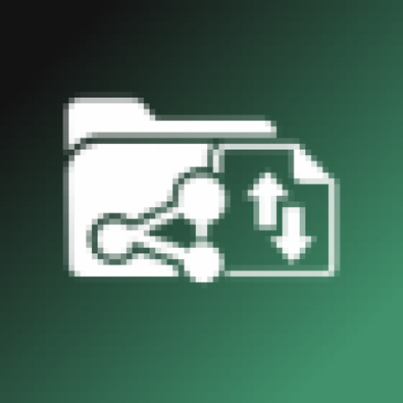
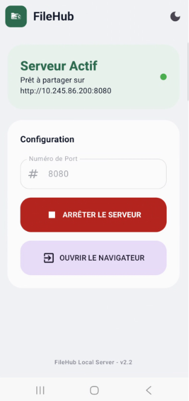
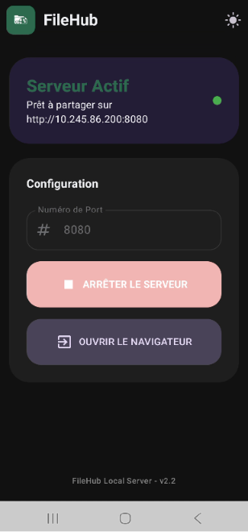
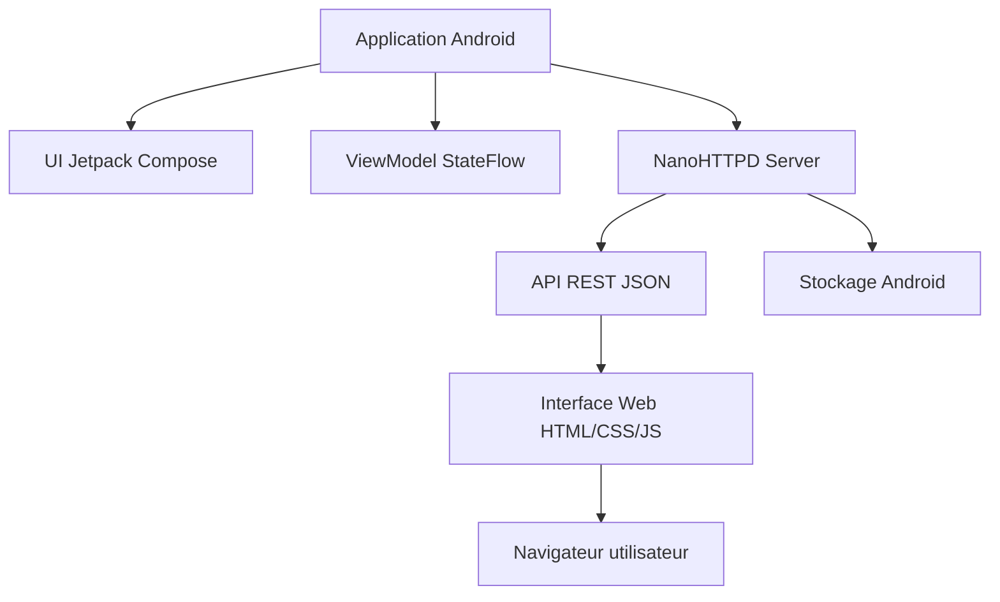

# FileHub Server

<p align="left">
  
</p>

Serveur HTTP local Android permettant d’accéder et gérer les fichiers d’un smartphone depuis un navigateur web sur le même réseau Wi-Fi.

---

## Table des matières


- [Présentation](#présentation)
- [Fonctionnalités](#fonctionnalités)
- [Charte graphique et thème](#charte-graphique-et-thème)
- [Capture d’écran](#capture-décran)
- [Architecture](#architecture)
- [Installation (développement)](#installation-développement)
- [Installation APK (recommandé)](#installation-apk-recommandé)
- [Accès à l’interface web](#accès-à-linterface-web)
- [Configuration du port](#configuration-du-port)
- [Dépannage](#dépannage)
- [Ressources](#ressources)

---

## Présentation

FileHub Server transforme un smartphone Android en serveur de fichiers accessible via navigateur.

Il permet la gestion complète des fichiers sans câble USB.

---

## Fonctionnalités

### Fonctionnalités principales

| Fonction | Description |
|----------|-------------|
| Naviguer | Parcourir l’arborescence du stockage |
| Télécharger | Récupérer un fichier |
| Téléverser | Envoyer un fichier vers le téléphone |
| Éditer | Modifier un fichier texte |
| Supprimer | Supprimer fichier ou dossier |
| Créer | Créer un dossier |
| Renommer | Renommer fichier ou dossier |
| Visualiser images | Afficher les photos du smartphone |

---

## Technologies utilisées

### Android

- Kotlin
- Jetpack Compose (UI)
- ViewModel + StateFlow (architecture MVVM)
- Android SDK (API 23+)

### Serveur

- NanoHTTPD (serveur HTTP léger embarqué)
- API REST (JSON)
- Gestion des fichiers système Android

### Interface Web

- HTML5
- CSS3
- JavaScript vanilla
- Fetch API

### Communication

- HTTP local via réseau Wi-Fi
- Échange JSON pour les métadonnées
- Téléchargement direct de fichiers (stream HTTP)

---

## Charte graphique et thème

L’application repose sur une interface moderne, sobre et orientée productivité, avec un système de thème clair/sombre permettant une utilisation confortable dans tous les contextes.

### Thème de l’application

| Élément | Mode clair | Mode sombre |
|--------|------------|--------------|
| Thème principal | Light (par défaut) | Dark (toggle manuel) |
| Couleur d’accent | #2D6A4F | #40916C |
| Arrière-plan | #F1F3F5 | #121212 |
| Surfaces (cards, sidebar) | #FCFCFC | #1E1E1E |
| Texte principal | #111827 | #F3F4F6 |

### Direction visuelle

- Couleurs dominantes : vert et gris pour évoquer la fiabilité et la gestion de fichiers
- Accent principal : vert utilisé pour les actions importantes (navigation, téléchargement, validation)
- Design basé sur la lisibilité et la hiérarchie visuelle

### Choix UI/UX

- Interface minimaliste type explorateur de fichiers
- Hiérarchie claire entre dossiers et fichiers
- Boutons d’action explicites (navigation, téléchargement, suppression)
- Optimisation pour usage desktop via navigateur
- Bascule fluide entre mode clair et sombre
- Fil d’Ariane (breadcrumb) pour la navigation
- Effets de survol pour indiquer les éléments interactifs

---

## Capture d’écran

### Page principale

<p align="center">
  
  
</p>
---

## Architecture


```mermaid
flowchart TD

A[Application Android] --> B[UI Jetpack Compose]
A --> C[ViewModel StateFlow]
A --> D[NanoHTTPD Server]

D --> E[API REST JSON]
D --> F[Stockage Android]

E --> G[Interface Web HTML/CSS/JS]
G --> H[Navigateur utilisateur]
```

---

## Installation (développement)

```bash id="clone01"
git clone https://github.com/MeryemCevik/FileHub-Server.git
```

Ouvrir le projet avec **Android Studio**, puis synchroniser Gradle.

Lancer l’application sur un appareil Android (API 23+) ou un émulateur.

---

## Installation APK (recommandé)

Télécharger et installer l’APK disponible dans la section **Releases** du dépôt.

Puis :

* Installer l’application sur le téléphone Android
* Connecter le téléphone et le PC sur le **même réseau Wi-Fi**
* Lancer l’application
* L’adresse IP du serveur s’affiche directement dans l’application

---

## Accès à l’interface web

Une fois l’application lancée, vous pouvez accéder au serveur de plusieurs façons :

### 1. Via le bouton "Ouvrir"
Il suffit de cliquer sur ce bouton qui vous redirige vers la page web directement.

---

### 2. En copiant le lien

L’application affiche directement l’URL complète du serveur.
Il suffit de copier ce lien et de le coller dans un navigateur (Chrome, Edge, etc.).

---

### 3. Via QR code

L’application génère un **QR code** contenant l’adresse du serveur.

* Ouvrir l’appareil photo ou une application de scan QR
* Scanner le code affiché dans l’application
* Le lien s’ouvre automatiquement dans le navigateur

---

## Configuration du port

Par défaut, le serveur utilise le port :

```id="port01"
8080
```

### Changer le port

Le port peut être modifié directement depuis l’**interface de l’application** :

* Ouvrir l’application
* Modifier le champ **Port**
* Redémarrer le serveur dans l’application

Exemple :

* Port configuré : `9090`

Alors l’accès devient :

```id="url02"
http://192.168.1.25:9090
```

---

## Dépannage (problèmes fréquents)

### ❌ Impossible d’accéder à l’interface

* Vérifier que le téléphone et le PC sont sur le **même Wi-Fi**
* Vérifier que le serveur est bien lancé dans l’application
* Vérifier l’adresse IP affichée (elle peut changer après redémarrage)

---

### ❌ La page ne charge pas

* Essayer un autre navigateur
* Désactiver VPN / proxy sur le PC
* Vérifier que le port utilisé est bien celui affiché dans l’app

---

### ❌ IP change souvent

* C’est normal sur certains réseaux Wi-Fi
* Relancer l’application pour obtenir la nouvelle adresse

---

## Ressources

- Projet inspiré de : Android Http File Server
  https://github.com/WPSeven/Android-Http-File-Server
