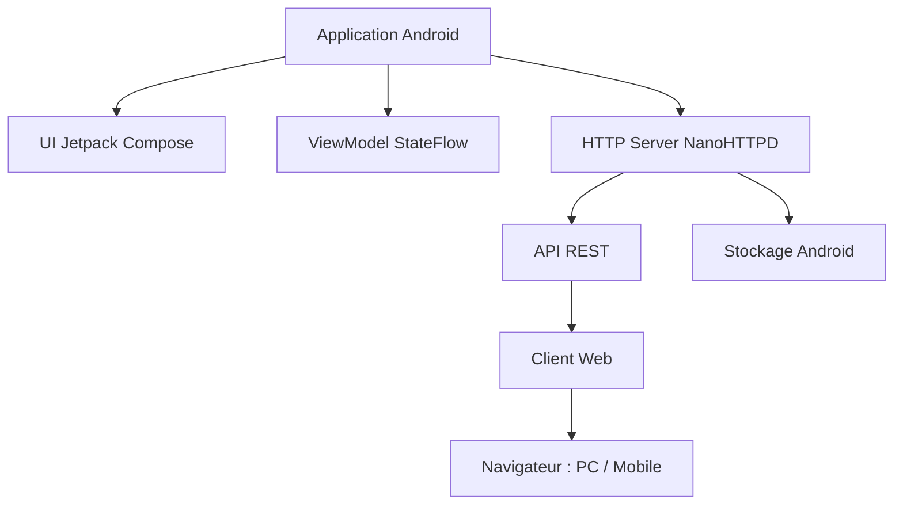

# FileHub Server — Sujet du projet

---

## Table des matières

- [1. Contexte](#1-contexte)
- [2. Objectif](#2-objectif)
- [3. Fonctionnalités](#3-fonctionnalités)
- [4. Contraintes techniques](#4-contraintes-techniques)
- [5. Architecture](#5-architecture)
- [6. Ressources](#6-ressources)

---

## 1. Contexte

FileHub Server est une application Android transformant un smartphone en serveur HTTP local accessible via navigateur web sur le même réseau Wi-Fi.

Le but est de permettre la gestion complète des fichiers sans câble USB.

---

## 2. Objectif

Développer un serveur de fichiers accessible depuis un navigateur permettant :

- navigation dans les fichiers
- transfert de fichiers
- modification et gestion complète à distance

---

## 3. Fonctionnalités

| Fonction | Description |
|----------|-------------|
| Naviguer | Parcourir l’arborescence du stockage |
| Télécharger | Récupérer un fichier |
| Téléverser | Envoyer un fichier vers le téléphone |
| Éditer | Modifier un fichier texte |
| Supprimer | Supprimer fichier ou dossier |
| Créer | Créer un dossier |
| Renommer | Renommer fichier ou dossier |

---

## 4. Contraintes techniques

- Android : Kotlin + Jetpack Compose
- Serveur : NanoHTTPD
- Interface web : HTML / CSS / JavaScript
- Architecture : API REST (JSON + fichiers)
- API Android minimum : 23

---

## 5. Architecture

---

## 6. Ressources

Projet basé sur :
- Android-Http-File-Server  
https://github.com/WPSeven/Android-Http-File-Server
